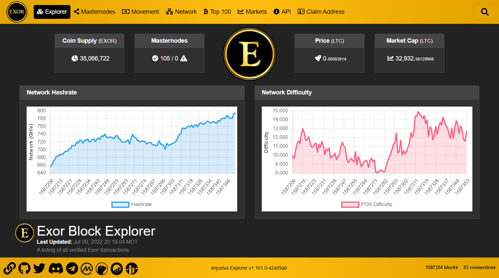

# eIquidus


Written in node.js and mongodb, eIquidus is the most stable, secure, customizable and feature-rich open-source block explorer with support for virtually any altcoin that implements some form of the [Bitcoin RPC API protocol](https://developer.bitcoin.org/reference/rpc/index.html). Originally built for the [Exor blockchain](https://github.com/team-exor/exor), eIquidus has since grown into a fully-featured explorer with a focus on stability and security at its core. All features from the [original iquidus explorer](https://github.com/iquidus/explorer) are included here along with many new ideas from other iquidus forks, and an absolute ton of new custom changes and bug fixes that were developed specifically for eIquidus.



### Premium Support

All code in this project is open source and available free-of-charge under the BSD-3-Clause license. If you require assistance setting up an explorer for your coin, or are interested in hiring a developer to incorporate custom changes for your explorer, you may contact the developer using the links below:

<div align="center">
<a href="https://discord.gg/dSuGm3y"></a>&nbsp;
<a href="https://t.me/joeuhren"></a>
</div>

Table of Contents
------------------

- [Features](#features)
- [See it in Action](#see-it-in-action)
- [Installation](#installation)
  - [Full Setup Guide](#full-setup-guide)
  - [Quick Install Instructions](#quick-install-instructions)
    - [Pre-Install](#pre-install)
    - [Database Setup](#database-setup)
    - [Download Source Code](#download-source-code)
    - [Install Node Modules](#install-node-modules)
    - [Configure Explorer Settings](#configure-explorer-settings)
- [Start/Stop the Explorer](#startstop-the-explorer)
  - [Start Explorer (Use for Testing)](#start-explorer-use-for-testing)
  - [Stop Explorer (Use for Testing)](#stop-explorer-use-for-testing)
  - [Start Explorer Using PM2 (Recommended for Production)](#start-explorer-using-pm2-recommended-for-production)
  - [Start Explorer Using PM2 and Log Viewer](#start-explorer-using-pm2-and-log-viewer)
  - [Stop Explorer Using PM2 (Recommended for Production)](#stop-explorer-using-pm2-recommended-for-production)
  - [Reload Explorer Using PM2 (Recommended for Production)](#reload-explorer-using-pm2-recommended-for-production)
  - [Start Explorer Using Forever (Alternate Production Option)](#start-explorer-using-forever-alternate-production-option)
  - [Stop Explorer Using Forever (Alternate Production Option)](#stop-explorer-using-forever-alternate-production-option)
  - [Reload Explorer Using Forever (Alternate Production Option)](#reload-explorer-using-forever-alternate-production-option)
- [Syncing Databases with the Blockchain](#syncing-databases-with-the-blockchain)
  - [Commands for Manually Syncing Databases](#commands-for-manually-syncing-databases)
  - [Sample Crontab](#sample-crontab)
- [Wallet Settings](#wallet-settings)
- [Run Express Webserver on Port 80](#run-express-webserver-on-port-80)
  - [Use Setcap to Safely Grant User Permissions](#use-setcap-to-safely-grant-user-permissions)
  - [Use Another Webserver as a Reverse Proxy](#use-another-webserver-as-a-reverse-proxy)
- [TLS/SSL Support](#tlsssl-support)
  - [Prerequisites](#prerequisites)
  - [Manually Link TLS/SSL Certificates to the Explorer](#manually-link-tlsssl-certificates-to-the-explorer)
  - [Use Nginx as a Reverse Proxy](#use-nginx-as-a-reverse-proxy)
- [CORS Support](#cors-support)
  - [What is CORS?](#what-is-cors)
  - [How to Benefit From Using CORS?](#how-to-benefit-from-using-cors)
- [Useful Scripts](#useful-scripts)
  - [Update Explorer Script](#update-explorer-script)
  - [Backup Database Script](#backup-database-script)
  - [Restore Database Script](#restore-database-script)
  - [Delete Database Script](#delete-database-script)
- [Known Issues](#known-issues)
- [Donations / Support Us](#donations--support-us)
- [Special Thanks](#special-thanks)
- [License](#license)

### Features

- Built using the following scripts and technologies:
  - Node.js (v16.13.1 or newer recommended)
  - MongoDB (v5.0.4 or newer recommended)
  - JQuery v3.6.0
  - Bootstrap v5.1.3
  - DataTables v1.11.3
  - FontAwesome v5.15.4
  - Luxon v2.1.1
  - jqPlot v1.0.9
  - Chart.js v3.6.1
    - chartjs-plugin-crosshair v1.2.0 ([https://github.com/abelheinsbroek/chartjs-plugin-crosshair](https://github.com/abelheinsbroek/chartjs-plugin-crosshair))
  - OverlayScrollbars v1.13.3
  - flag-icon-css v4.1.4 ([https://github.com/lipis/flag-icon-css](https://github.com/lipis/flag-icon-css))
- Platform independent (tested to run on Windows, MacOS and Linux) **NOTE:** Most of the instructions in this guide were written for use with Linux and may need to be modified when using another OS
- Mobile-friendly
- Sass support
- Pages/features:
  - **Home/Explorer:** Displays latest blockchain transactions
  - **Masternodes:** Displays the current listing of all masternodes known to be active on the network. *\*only applicable to masternode coins*
  - **Movement:** Displays latest blockchain transactions that are greater than a certain configurable amount
  - **Network:** Displays a list of peers that have connected to the coind wallet in the past 24 hours, along with useful addnode data that can be used to connect your own wallets to the network easier
  - **Top 100:** Displays the top 100 richest wallet addresses, the top 100 wallet addresses that have the highest total number of coins received based on adding up all received transactions, as well as a table and pie chart breakdown of wealth distribution. Additional support for omitting burned coins from top 100 lists
  - **Markets:** Displays a number of exchange-related metrics including market summary, 24 hour chart, most recent buy/sell orders and latest trade history. The last known default exchange price is automatically converted to USD using the coingecko api from [https://www.coingecko.com/en/api](https://www.coingecko.com/en/api). The following 12 cryptocurrency exchanges are supported:
    - [AltMarkets](https://altmarkets.io)
    - [Bittrex](https://bittrex.com)
    - [Bleutrade](https://bleutrade.com)
    - [Crex24](https://crex24.com)
    - [Dex-Trade](https://dex-trade.com)
    - [FreiExchange](https://freiexchange.com)/[FreiXLite](https://freixlite.com) *\*no chart support due to a lack of OHLCV api data*
    - [Poloniex](https://poloniex.com)
    - [SouthXchange](https://southxchange.com)
    - [Stex](https://stex.com)
    - [Txbit](https://txbit.io) *\*no chart support due to a lack of OHLCV api data*
    - [Unnamed](https://unnamed.exchange)
    - [Yobit](https://yobit.io) *\*no chart support due to a lack of OHLCV api data*
  - **API:** A listing of available public API's that can be used to retrieve information from the network without the need for a local wallet. The following public API's are supported:
    - **RPC API calls** (Return data from coind)
      - **getdifficulty:** Returns the current difficulty
      - **getconnectioncount:** Returns the number of connections the block explorer has to other nodes
      - **getblockcount:** Returns the current block index
      - **getblockhash:** Returns the hash of the block at a specific index
      - **getblock:** Returns information about the block with the given hash
      - **getrawtransaction:** Returns raw transaction representation for given transaction id
      - **getnetworkhashps:** Returns the current network hashrate
      - **getvotelist:** Returns the current vote list
      - **getmasternodecount:** Returns the total number of masternodes on the network *\*only applicable to masternode coins*
    - **Extended API calls** (Return data from local indexes)
      - **getmoneysupply:** Returns current money supply
      - **getdistribution:** Returns wealth distribution stats
      - **getaddress:** Returns information for given address
      - **getaddresstxs:** Returns transactions for a wallet address starting from a particular offset
      - **gettx:** Returns information for given tx hash
      - **getbalance:** Returns current balance of given address
      - **getlasttxs:** Returns transactions greater than a specific number of coins, starting from a particular offset
      - **getcurrentprice:** Returns last known exchange price
      - **getbasicstats:** Returns basic statistics about the coin including: block count, circulating supply, USD price, default market price and # of masternodes *\*# of masternodes is only applicable to masternode coins*
      - **getsummary:** Returns a summary of coin data including: difficulty, hybrid difficulty, circulating supply, hash rate, default market price, network connection count, block count, count of online masternodes and count of offline masternodes *\*masternode counts are only applicable to masternode coins*
      - **getnetworkpeers:** Returns the list of network peers that have connected to the explorer node in the last 24 hours
      - **getmasternodelist:** Returns the complete list of masternodes on the network *\*only applicable to masternode coins*
      - **getmasternoderewards:** Returns a list of masternode reward transactions for a specific address that arrived after a specific block height *\*only applicable to masternode coins*
      - **getmasternoderewardstotal:** Returns the total number of coins earned in masternode rewards for a specific address that arrived after a specific block height *\*only applicable to masternode coins*
  - **Claim Address:** Allows anyone to set custom display names for wallet addresses that they own using the **Sign Message** feature from their local wallet. Includes *bad word* filter support.
  - **Block Info:** Displays block summary and list of transactions for a specific block height
  - **Transaction Info:** Displays transaction summary, optional OP_RETURN value, list of input addresses and output addresses for a specific transaction
  - **Address Info:** Displays wallet address summary (balance, total sent, total received, QR code) and a list of latest transactions for a specific wallet address
- Choose from 26 built-in themes with tweakable settings such as light and dark options to customize the look and feel of the explorer:
  - **Exor** *\*default theme made especially for eIquidus*
  - **Cerulean** ([Preview](https://bootswatch.com/cerulean/))
  - **Cosmo** ([Preview](https://bootswatch.com/cosmo/))
  - **Cyborg** ([Preview](https://bootswatch.com/cyborg/))
  - **Darkly** ([Preview](https://bootswatch.com/darkly/))
  - **Flatly** ([Preview](https://bootswatch.com/flatly/))
  - **Journal** ([Preview](https://bootswatch.com/journal/))
  - **Litera** ([Preview](https://bootswatch.com/litera/))
  - **Lumen** ([Preview](https://bootswatch.com/lumen/))
  - **Lux** ([Preview](https://bootswatch.com/lux/))
  - **Materia** ([Preview](https://bootswatch.com/materia/))
  - **Minty** ([Preview](https://bootswatch.com/minty/))
  - **Morph** ([Preview](https://bootswatch.com/morph/))
  - **Pulse** ([Preview](https://bootswatch.com/pulse/))
  - **Quartz** ([Preview](https://bootswatch.com/quartz/))
  - **Sandstone** ([Preview](https://bootswatch.com/sandstone/))
  - **Simplex** ([Preview](https://bootswatch.com/simplex/))
  - **Sketchy** ([Preview](https://bootswatch.com/sketchy/))
  - **Slate** ([Preview](https://bootswatch.com/slate/))
  - **Solar** ([Preview](https://bootswatch.com/solar/))
  - **Spacelab** ([Preview](https://bootswatch.com/spacelab/))
  - **Superhero** ([Preview](https://bootswatch.com/superhero/))
  - **United** ([Preview](https://bootswatch.com/united/))
  - **Vapor** ([Preview](https://bootswatch.com/vapor/))
  - **Yeti** ([Preview](https://bootswatch.com/yeti/))
  - **Zephyr** ([Preview](https://bootswatch.com/zephyr/))
- Customizable panels at the top of every page to display the following information:
  - **Network:** Displays the current network hash rate *\*only applicable to POW coins*
  - **Difficulty:** Displays the current proof-of-work and/or proof-of-stake difficulty
  - **Masternodes:** Displays a count of online and unreachable masternodes *\*only applicable to masternode coins*
  - **Coin Supply:** Displays the current circulating coin supply value
  - **Price:** Displays the current market price (value measured using default market pair)
  - **Market Cap:** Displays the current market cap value in (value measured using default market pair)
  - **Logo:** Display an image of your coin logo
- Configurable network charts that can be independently displayed in the header of any page
  - **Hashrate chart:** Line graph listing of the estimated network hashes per second over the last number of blocks *\*Requires a full sync before network data will start being collected*
  - **Difficulty chart:** Line graph listing of the block difficulty over the last number of blocks *\*Requires a full sync before network data will start being collected*
- Add as many custom social links to the explorer footer as desired. Useful for linking to github, twitter, coinmarketcap or any other social media or external links as necessary. 
- Custom rpc/api command support which increases blockchain compatibility. Supported cmds:
  - **getnetworkhashps:** Returns the estimated network hashes per second
  - **getmininginfo:** Returns a json object containing mining-related information
  - **getdifficulty:** Returns the proof-of-work difficulty as a multiple of the minimum difficulty
  - **getconnectioncount:** Returns the number of connections to other nodes
  - **getblockcount:** Returns the number of blocks in the longest blockchain
  - **getblockhash:** Returns hash of block in best-block-chain at height provided
  - **getblock:** Returns an object with information about the block
  - **getrawtransaction:** Returns raw transaction data
  - **getinfo:** Returns an object containing various state info
  - **getblockchaininfo:** Returns an object containing various state info regarding blockchain processing
  - **getpeerinfo:** Returns data about each connected network node as a json array of objects
  - **gettxoutsetinfo:** Returns an object with statistics about the unspent transaction output set
  - **getvotelist:** Returns an object with details regarding the current vote list
  - **getmasternodecount:** Returns a json object containing the total number of masternodes on the network
  - **getmasternodelist:** Returns a json array containing status information for all masternodes on the network
  - **verifymessage:** Verify a signed message. Must accept the following arguments:
    - **address:** The wallet address to use for the signature
    - **signature:** The signature provided by the signer in base 64 encoding
    - **message:** The message that was signed
- Additional support for the following custom blockchain features:
  - Bitcoin P2PK transactions
    - Bitcoin rpc/api cmds:
      - **getdescriptorinfo:** Accepts a descriptor as input and returns an object with more detailed information, including its computed checksum
      - **deriveaddresses:** Accepts an output descriptor as input and returns an array containing one or more P2PKH addresses
  - Heavycoin democratic voting and reward support
    - **Reward Page:** Displays reward/voting information
    - Heavycoin rpc/api cmds:
      - **getmaxmoney:** Returns the number of coins that will be produced in total
      - **getmaxvote:** Returns the maximum allowed vote for the current phase of voting
      - **getvote:** Returns the current block reward vote setting
      - **getphase:** Returns the current voting phase name
      - **getreward:** Returns the current block reward
      - **getsupply:** Returns the current money supply
      - **getnextrewardestimate:** Returns an estimate for the next block reward based on the current state of decentralized voting
      - **getnextrewardwhenstr:** Returns a string describing how long until the votes are tallied and the next block reward is computed
    - Heavycoin public API's:
      - **getmaxmoney:** Returns the maximum possible money supply
      - **getmaxvote:** Returns the maximum allowed vote for the current phase of voting
      - **getvote:** Returns the current block reward vote setting
      - **getphase:** Returns the current voting phase
      - **getreward:** Returns the current block reward, which has been decided democratically in the previous round of block reward voting
      - **getsupply:** Returns the current money supply
      - **getnextrewardestimate:** Returns an estimate for the next block reward based on the current state of decentralized voting
      - **getnextrewardwhenstr:** Returns a string describing how long until the votes are tallied and the next block reward is computed
  - Zcash/zk-SNARKs private tx support

### See it in Action

-  https://explorer.exor.io/

### Installation

#### Full Setup Guide

While we do not yet have our own step-by-step setup instructions, there are a few well-written guides out there already that detail how to set up and install the [original iquidus explorer](https://github.com/iquidus/explorer). Because the setup process for iquidus is more-or-less identical to eIquidus at this moment in time (making changes to settings.json is probably the biggest difference although we have helpful comments for each setting), here are some of the more complete guides that may be useful for anyone who needs more detailed instructions than are provided in the [Quick Install Instructions](#quick-install-instructions):

1. [Beginners Guide for Iquidus Explorer Setup](https://gist.github.com/samqju/b9fc6c007f083e6429387051e24da1c3)
2. [Node and Iquidus Explorer Setup for Dummies](https://gist.github.com/scottie/b6179c34ce3cf200fcc5d08727a46623)
3. [Iquidus Block Explorer Guide](https://www.reddit.com/r/BiblePay/comments/7elm7r/iquidus_block_explorer_guide)
4. [The Ultimate Iquidus Explorer Installation Guide - WAYBACKMACHINE](https://web.archive.org/web/20210228210054/https://stakeandnodes.net/iquidus-explorer-installation-guide/)

#### Quick Install Instructions

##### Pre-Install

The following prerequisites must be installed before using the explorer:

- [Node.js](https://nodejs.org/en/) (v14.15.4 or newer recommended)
- [MongoDB](https://www.mongodb.com/) (v4.4.3 or newer recommended)
- [Git](https://git-scm.com/downloads) (v2.36.0 or newer recommended)
- A fully synchronized *coind* wallet daemon that supports the [Bitcoin RPC API protocol](https://developer.bitcoin.org/reference/rpc/index.html). **NOTE:** In most cases, the blockchain must be synced with the `txindex` feature enabled to have access to all transactions. See the [Wallet Settings](#wallet-settings) section for more details.

##### Database Setup

Open the MongoDB cli:

```
mongo
```

Select database:

**NOTE:** `explorerdb` is the name of the database where you will be storing local explorer data. You can change this to any name you want, but you must make sure that you set the same name in the `settings.json` file for the `dbsettings.database` setting.

```
use explorerdb
```

Create a new user with read/write access:

```
db.createUser( { user: "eiquidus", pwd: "Nd^p2d77ceBX!L", roles: [ "readWrite" ] } )
```

##### Download Source Code

```
git clone https://github.com/team-exor/eiquidus explorer
```

##### Install Node Modules

```
cd explorer && npm install --only=prod
```

##### Configure Explorer Settings

```
cp ./settings.json.template ./settings.json
```

*Make required changes in settings.json*

**NOTE:** You can further customize the site by adding your own javascript code to the `public/js/custom.js` file and css rules to the `public/css/custom.scss` file. Adding changes to `custom.js` and `custom.scss` is the preferred method of customizing your site, without affecting the ability to receive explorer code updates in the future.

### Start/Stop the Explorer

#### Start Explorer (Use for Testing)

You can launch the explorer in a terminal window that will output all warnings and error msgs with one of the following cmds (be sure to run from within the explorer directory):

```
npm start
```

or (useful for crontab):

```
cd /path/to/explorer && /path/to/npm run prestart && /path/to/node --stack-size=10000 ./bin/cluster
```

**NOTE:** mongod must be running to start the explorer.

The explorer defaults to cluster mode by forking an instance of its process to each cpu core, which results in increased performance and stability. Load balancing gets automatically taken care of and any instances that for some reason die, will be restarted automatically. If desired, a single instance can be launched with:

```
npm run start-instance
```

or (useful for crontab):

```
cd /path/to/explorer && /path/to/npm run prestart && /path/to/node --stack-size=10000 ./bin/cluster 1
```

#### Stop Explorer (Use for Testing)

To stop the explorer running with `npm start` you can end the process with the key combination `CTRL+C` in the terminal that is running the explorer, or from another terminal you can use one of the following cmds (be sure to run from within the explorer directory):

```
npm stop
```

or (useful for crontab):

```
cd /path/to/explorer && /path/to/node ./scripts/stop_explorer.js
```

#### Start Explorer Using PM2 (Recommended for Production)

[PM2](https://www.npmjs.com/package/pm2) is a process manager for Node.js applications with a built-in load balancer that allows you to always keep the explorer alive and running even if it crashes. Once you have configured the explorer to work properly in a production environment, it is recommended to use PM2 to start and stop the explorer instead of `npm start` and `npm stop` to keep the explorer constantly running without the need to always keep a terminal window open.

You can start the explorer using PM2 with one of the following terminal cmds (be sure to run from within the explorer directory):

```
npm run start-pm2
```

or (useful for crontab):

```
cd /path/to/explorer && /path/to/npm run prestart "pm2" && /path/to/pm2 start ./bin/instance -i 0 -n explorer -p "./tmp/pm2.pid" --node-args="--stack-size=10000"
```

**NOTE:** Use the following cmd to find the install path for PM2 (Linux only):

```
which pm2
```

#### Start Explorer Using PM2 and Log Viewer

Alternatively, you can start the explorer using PM2 and automatically open the log viewer which will allow for viewing all warnings and error msgs as they come up by using one of the following terminal cmds (be sure to run from within the explorer directory):

```
npm run start-pm2-debug
```

or (useful for crontab):

```
cd /path/to/explorer && /path/to/npm run prestart "pm2" && /path/to/pm2 start ./bin/instance -i 0 -n explorer -p "./tmp/pm2.pid" --node-args="--stack-size=10000" && /path/to/pm2 logs
```

#### Stop Explorer Using PM2 (Recommended for Production)

To stop the explorer when it is running via PM2 you can use one of the following terminal cmds (be sure to run from within the explorer directory):

```
npm run stop-pm2
```

or (useful for crontab):

```
cd /path/to/explorer && /path/to/pm2 stop explorer
```

#### Reload Explorer Using PM2 (Recommended for Production)

The explorer can be stopped and restarted in a single cmd when it is running via PM2, which is often necessary after updating the explorer code for example. Use one of the following terminal cmds to reload the explorer (be sure to run from within the explorer directory):

**NOTE:** Assuming the explorer has access to 2 or more cpus, this reload will be done in such a way that there will be zero-downtime while the restart is being performed. If you only have a single cpu then the explorer will be inaccessible for a few seconds while the restart is being performed.

```
npm run reload-pm2
```

or (useful for crontab):

```
cd /path/to/explorer && /path/to/pm2 reload explorer
```

#### Start Explorer Using Forever (Alternate Production Option)

[Forever](https://www.npmjs.com/package/forever) is an alternative to PM2 which is another useful Node.js module that is used to always keep the explorer alive and running even if the explorer crashes or stops. Once you have configured the explorer to work properly in a production environment, forever can be used as an alternative to PM2 to start and stop the explorer instead of `npm start` and `npm stop` to keep the explorer constantly running without the need to always keep a terminal window open.

You can start the explorer using forever with one of the following terminal cmds (be sure to run from within the explorer directory):

```
npm run start-forever
```

or (useful for crontab):

```
cd /path/to/explorer && /path/to/npm run prestart "forever"
```

**NOTE:** Use the following cmd to find the install path for forever (Linux only):

```
which forever
```

#### Stop Explorer Using Forever (Alternate Production Option)

To stop the explorer when it is running via forever you can use one of the following terminal cmds (be sure to run from within the explorer directory):

```
npm run stop-forever
```

or (useful for crontab):

```
cd /path/to/explorer && /path/to/forever stop "explorer"
```

#### Reload Explorer Using Forever (Alternate Production Option)

The explorer can be stopped and restarted in a single cmd when it is running via forever, which is often necessary after updating the explorer code for example. Use one of the following terminal cmds to reload the explorer (be sure to run from within the explorer directory):

**NOTE:** The explorer will be inaccessible for a few seconds while the restart is being performed.

```
npm run reload-forever
```

or (useful for crontab):

```
cd /path/to/explorer && /path/to/forever restart "explorer"
```

### Syncing Databases with the Blockchain

sync.js (located in scripts/) is used for updating the local databases. This script must be called from the explorers root directory.

```
Usage: /path/to/node scripts/sync.js [mode]

Mode: (required)
update           Updates index from last sync to current block
check            Checks index for (and adds) any missing transactions/addresses
                 Optional parameter: block number to start checking from
reindex          Clears index then resyncs from genesis to current block
reindex-rich     Clears and recreates the richlist data
reindex-txcount  Rescan and flatten the tx count value for faster access
reindex-last     Rescan and flatten the last blockindex value for faster access
market           Updates market summaries, orderbooks, trade history + charts
peers            Updates peer info based on local wallet connections
masternodes      Updates the list of active masternodes on the network

Notes:
- 'current block' is the latest created block when script is executed.
- The market + peers databases only support (& defaults to) reindex mode.
- If check mode finds missing data (other than new data since last sync),
  this likely means that sync.update_timeout in settings.json is set too low.
```

*It is recommended to do the initial syncing of your blockchain, markets, peers and masternodes using the manual commands below to ensure there are no sync issues. When you are sure that everything is syncing correctly, you should then install the necessary scripts to a crontab at 1+ minute intervals as indicated below*

#### Commands for Manually Syncing Databases

A number of npm scripts are included with the explorer for easy syncing of the various explorer databases. The following scripts are the main commands used for syncing the explorer with your blockchain:

- `npm run sync-blocks`: Connect to the wallet daemon to pull blocks/transactions into the explorer, starting from genesis to current block. Repeat calls of this command will remember the last block downloaded, to allow continuous syncing of new blocks.
- `npm run sync-markets`: Connect to the various exchange apis as defined in the `settings.json` file to provide market related data such as market summaries, orderbooks, trade history and charts.
- `npm run sync-peers`: Connect to the wallet daemon and pull in data regarding connected nodes.
- `npm run sync-masternodes`: Connect to the wallet daemon and pull in the list of active masternodes on the network. *\*only applicable to masternode coins*

A small handful of useful scripts are also included to assist in solving various issues you may experience with the explorer:

- `npm run check-blocks`: Recheck all previously synced blocks by comparing against the wallet daemon to look for and add any missing transactions/addresses. Optional parameter: block number to start checking from. Example: `npm run check-blocks 1000` will begin the check starting at block 1000. :warning: **WARNING:** This can take a very long time depending on the length of the blockchain and is generally not recommended unless absolutely necessary. Furthermore, while you are checking for missing data, you will be unable to sync new blocks into the explorer until the check command has finished. If you do find missing transactions with this check (other than new data since last sync), this likely means that `sync.update_timeout` in `settings.json` is set too low.
- `npm run reindex`: Delete all blocks, transactions and addresses, and resync from genesis to current block. :warning: **WARNING:** This will wipe out all blockchain-related data from the explorer. It is recommended to [backup the explorer database](#backup-database-script) before continuing with this command.
- `npm run reindex-rich`: Clears and recreates the richlist data for the top 100 coin holders page. Rarely needed, but can be useful for debugging or if you are certain the richlist data is incorrect for some reason.
- `npm run reindex-txcount`: Recalculate the count of transactions stored in `stats.txes` by recounting the txes stored in the mongo database. Rarely needed, but can be useful for debugging or if you notice the main list of transactions is showing the wrong number of entries. If this value is off for some reason, you will not be able to page back to the 1st blocks on the main list of transactions for example.
- `npm run reindex-last`: Lookup the last transaction in the mongo database and reset the `stats.last` value to that most recent block index. Rarely needed, but can be useful for debugging. The `stats.last` value is used to remember which block the last sync left off on to resume syncing from the next block.

Also see the [Useful Scripts](#useful-scripts) section for more helpful scripts.

#### Sample Crontab

*Example crontab; update index every minute, market data every 2 minutes, peers and masternodes every 5 minutes*

Easier crontab syntax using npm scripts, but may not work on some systems depending on permissions and how nodejs was installed:

```
*/1 * * * * cd /path/to/explorer && npm run sync-blocks > /dev/null 2>&1
*/2 * * * * cd /path/to/explorer && npm run sync-markets > /dev/null 2>&1
*/5 * * * * cd /path/to/explorer && npm run sync-peers > /dev/null 2>&1
*/5 * * * * cd /path/to/explorer && npm run sync-masternodes > /dev/null 2>&1
```

Or, run the crontab by calling the sync script directly, which should work better in the event you have problems running the npm scripts from a crontab:

```
*/1 * * * * cd /path/to/explorer && /path/to/node scripts/sync.js update > /dev/null 2>&1
*/2 * * * * cd /path/to/explorer && /path/to/node scripts/sync.js market > /dev/null 2>&1
*/5 * * * * cd /path/to/explorer && /path/to/node scripts/sync.js peers > /dev/null 2>&1
*/5 * * * * cd /path/to/explorer && /path/to/node scripts/sync.js masternodes > /dev/null 2>&1
```

### Wallet Settings

The wallet connected to eIquidus must be running with the following flags:

```
-daemon -txindex
```

You may either call your coins daemon using this syntax:

```
coind -daemon -txindex
```

or else you can add the settings to your coins config file (recommended):

```
daemon=1
txindex=1
```

### Run Express Webserver on Port 80

A typical webserver binds to port 80 to serve webpages over the http protocol, but the Express webserver cannot do this by default unless it is given root permissions, which isn't recommended for security reasons. Instead, there are two recommended workarounds to achieve the same end result:

**NOTE:** Be sure to allow port 80 through any firewalls you may have configured or the explorer website may not be accessible remotely.

#### Use Setcap to Safely Grant User Permissions

**NOTE:** This option is only available to Linux users

1. You can use the `setcap` command to change the capabilities of the `node` binary file to specifically allow the Express webserver to bind to a port less than 1024 (this one-time cmd requires root privileges):

```
sudo setcap cap_net_bind_service=+ep `readlink -f \`which node\``
```

2. Open the `settings.json` file and change the `webserver.port` setting to a value of 80. Save the change and restart the explorer.

You should now be able to browse to the explorer by IP address or domain name without the need for specifying the 3001 port any longer.

#### Use Another Webserver as a Reverse Proxy

**NOTE:** The following instructions are for Linux users only, but installing and configuring another webserver should be possible on any OS

A few steps are involved in setting up another webserver that can bind to port 80 and forward all incoming traffic to the eIquidus node.js app. Any commercial webserver can be used to create the reverse proxy, but in this case, Nginx will be used as an example:

1. Install Nginx with the following terminal cmd:

```
sudo apt-get install nginx
```

2. Remove the default configuration file:

```
sudo rm /etc/nginx/sites-enabled/default
```

3. Create a new file in `/etc/nginx/sites-available/` called `node` and open it with the nano text editor:

```
sudo nano /etc/nginx/sites-available/node
```

4. Paste the following code in the file and make sure to change `example.com` to your domain or IP address, and change port `3001` on the `proxy_pass` line to the port # you have configured for the `webserver.port` setting in the `settings.json` file. When done editing, press CTRL+X, then Y (for yes to save) and then ENTER to finish saving the changes to the config file:

```
server {
    listen 80;
    server_name example.com;

    location / {
        proxy_set_header   X-Forwarded-For $remote_addr;
        proxy_set_header   Host $http_host;
        proxy_pass         "http://127.0.0.1:3001";
    }
}
```

5. Create a new symbolic link for the Nginx configuration file that was just created and link it to the `/etc/nginx/sites-enabled` directory:

```
sudo ln -s /etc/nginx/sites-available/node /etc/nginx/sites-enabled/node
```

6. Restart Nginx to apply the configuration changes:

```
sudo service nginx restart
```

7. Nginx will now forward all incoming requests to eIquidus and after restarting the explorer it should be browsable via http://example.com without the need for the http://example.com:3001 port any longer.

### TLS/SSL Support

Similar to [the problem with binding to port 80](#run-express-webserver-on-port-80), a typical webserver binds to port 443 to serve webpages over the https protocol, but the Express webserver cannot do this by default unless it is given root permissions, which isn't recommended for security reasons. Instead, there are two recommended workarounds to achieve the same end result: [Manually Link TLS/SSL Certificates to the Explorer](#manually-link-tlsssl-certificates-to-the-explorer) or [Use Nginx as a Reverse Proxy](#use-nginx-as-a-reverse-proxy).

**NOTE:** Be sure to allow port 443 through any firewalls you may have configured or the explorer website may not be accessible remotely.

#### Prerequisites

**NOTE:** The following instructions are for Linux users only, but installing and configuring certbot should be possible on any OS

There are a few common steps that must be completed before TLS/SSL certificates can be generated:

1. Install snapd:

```
sudo apt install snapd
```

2. Ensure that snapd is up to date:

```
sudo snap install core; sudo snap refresh core
```

3. Install certbot (full install instructions for different operating systems and configurations can be found here: [https://certbot.eff.org/instructions](https://certbot.eff.org/instructions)):

```
sudo snap install --classic certbot
```

4. Prepare the certbot command:

```
sudo ln -s /snap/bin/certbot /usr/bin/certbot
```

#### Manually Link TLS/SSL Certificates to the Explorer

**NOTE:** The following instructions are for Linux users only, but installing and configuring certbot should be possible on any OS

Follow the steps below to configure the Express webserver for use with TLS/SSL:

1. If you haven't already done so, run the `setcap` cmd from the [Use Setcap to Safely Grant User Permissions Instructions](#use-setcap-to-safely-grant-user-permissions) which will allow node.js to bind to port 443 without needing root permissions.

2. There are different options for generating a valid TLS/SSL certificate, but in this case it is assumed that you do not have another webserver running on port 80 and therefore the standalone install method will be used. If you do have a webserver running, this cmd will fail unless you temporarily stop the webserver before continuing:

```
sudo certbot certonly --standalone
```

Certbot will ask a few simple questions and generate the necessary TLS/SSL certificate files for your domain. It will also install the necessary files to automatically renew the certificates when they are about to expire, so you shouldn't need to do anything special to keep them up to date.

3. Once the TLS/SSL certificates are generated, you will need to grant permission to non-root users with the following commands:

```
sudo chmod -R 755 /etc/letsencrypt/live/
sudo chmod -R 755 /etc/letsencrypt/archive/
```

4. The last step is to enable TLS in the explorer's `settings.json` file and specify the paths to the 3 main certificate files that you just generated. Example:

```
  "webserver": {
    "port": 80,
    "tls": {
      "enabled": true,
      "port": 443,
      "cert_file": "/etc/letsencrypt/live/example.com/cert.pem",
      "chain_file": "/etc/letsencrypt/live/example.com/chain.pem",
      "key_file": "/etc/letsencrypt/live/example.com/privkey.pem"
    },
    "cors": {
      "enabled": false,
      "corsorigin": "*"
    }
  },
```

Ensure that `webserver.tls.enabled` = true and that you specify the exact path to the `webserver.tls.cert_file`, `webserver.tls.chain_file` and `webserver.tls.key_file` files by changing `example.com` to the domain name that you just generated TLS/SSL certificates for.

5. If all went well, you should now be able to start up the explorer and browse to it using a secure https connection like [https://example.com](https://example.com).

#### Use Nginx as a Reverse Proxy

**NOTE:** The following instructions are for Linux users only, but installing and configuring certbot and nginx should be possible on any OS

1. If you haven't already done so, first follow through the [Use Another Webserver as a Reverse Proxy Instructions](#use-another-webserver-as-a-reverse-proxy) and then continue with step #2 below.

2. Generate a new TLS/SSL certificate via certbot which will automatically edit your Nginx configuration files and enable https at the same time:

```
sudo certbot --nginx
```

Certbot will ask a few simple questions and generate the necessary TLS/SSL certificate files for your domain and link them to Nginx. It will also install the necessary files to automatically renew the certificates when they are about to expire, so you shouldn't need to do anything special to keep them up to date.

3. If all went well, you should now be able to start up the explorer and browse to it using a secure https connection like [https://example.com](https://example.com).

### CORS Support

eIquidus has basic CORS support which is useful to prevent other sites from consuming public APIs while still allowing specific websites whitelisted access.

#### What is CORS?

*CORS description taken from [MaxCDN One](https://www.maxcdn.com/one/visual-glossary/cors/)*

>To prevent websites from tampering with each other, web browsers implement a security measure known as the same-origin policy. The same-origin policy lets resources (such as JavaScript) interact with resources from the same domain, but not with resources from a different domain. This provides security for the user by preventing abuse, such as running a script that reads the password field on a secure website.

>In cases where cross-domain scripting is desired, CORS allows web developers to work around the same-origin policy. CORS adds HTTP headers which instruct web browsers on how to use and manage cross-domain content. The browser then allows or denies access to the content based on its security configuration.

#### How to Benefit From Using CORS?

You must first set up CORS in eIquidus by editing the settings.json file and setting the value for `webserver.cors.enabled` to true.

```
  "webserver": {
    "cors": {
      "enabled": true,
```

The `webserver.cors.corsorigin` setting defaults to "\*" which allows all requests from any origin. Keeping this setting at "\*" can lead to abuse and is not recommended. Therefore, you should change the `webserver.cors.corsorigin` setting to an external origin that you control, as seen in the following example:

```
  "webserver": {
    "cors": {
      "enabled": true,
      "corsorigin": "http://example.com"
```

The above example would allow sharing of resources from eIquidus for all data requests coming from the example.com domain, while all requests coming from any other domain would be rejected as per normal.

Below is an example of a simple javascript call using [jQuery](https://jquery.com) that could be used on your example.com website to return the current block count from eIquidus:

```
jQuery(document).ready(function($) {
  $.ajax({
    type: "GET",
    url: "http://your-eiquidus-url/api/getblockcount",
    cache: false
  }).done(function (data) {
    alert(data);
  });
});
```

### Useful Scripts

#### Update Explorer Script

Automatically download and install the newest explorer source code, update out-of-date dependencies and reload the explorer with a single command. This update script can be safely run while the explorer is actively running to prevent needing to manually shut down to do updates, but please note that the website may be inaccessible for a few seconds or more while the explorer is being updated.

**NOTE:** Only explorer installations that were installed via cloning the source from git can be automatically updated. Be sure to follow the [Quick Install Instructions](#quick-install-instructions) to set up the explorer for optimum use with this update script.

Update the explorer with the following command:

```
npm run update-explorer
```

or (useful for crontab):

```
cd /path/to/explorer && /path/to/node ./scripts/update_explorer.js
```

**NOTE:** The update script also supports a couple optional parameters.

Use the following command if you want to update the explorer code only, without checking for out-of-date dependencies:

```
npm run update-explorer "explorer-only"
```

or (useful for crontab):

```
cd /path/to/explorer && /path/to/node ./scripts/update_explorer.js "explorer-only"
```

Use the following command if you want to upgrade outdated dependencies only, without checking for explorer code updates:

```
npm run update-explorer "dependencies-only"
```

or (useful for crontab):

```
cd /path/to/explorer && /path/to/node ./scripts/update_explorer.js "dependencies-only"
```

#### Backup Database Script

Make a complete backup of an eIquidus mongo database and save to compressed file. A built-in locking mechanism prevents data from being updated or changed while a backup is in process. Backups can be safely created while the explorer is actively running and/or while the explorer is turned off. The following backup scenarios are supported:

**Backup Database (No filename specified)**

`npm run create-backup`: Backs up to the explorer/backups directory by default with the current date as the filename in the format  yyyy-MMM-dd.bak

**Backup Database (Partial filename specified)**

`npm run create-backup test`: Backs up the the explorer/backups directory by default with the filename test.bak

**Backup Database (Full filename specified)**

`npm run create-backup today.bak`: Backs up the the explorer/backups directory by default with the filename today.bak

**Backup Database (Full path with partial filename specified)**

`npm run create-backup /usr/local/bin/abc`: Backs up the the /usr/local/bin directory with the filename abc.bak

**Backup Database (Full path and filename specified)**

`npm run create-backup ~/new.bak`: Backs up the the users home directory with the filename new.bak

#### Restore Database Script

Restore a previously saved eIquidus mongo database backup. :warning: **WARNING:** This will completely overwrite your existing eIquidus mongo database, so be sure to make a full backup before proceeding. A built-in locking mechanism prevents data from being updated or changed while a backup is being restored. Backups can be safely restored while the explorer is actively running and/or while the explorer is turned off.

**NOTE:** Older v1.x eIquidus database backups were compressed into tar.gz files. These older tar.gz backups can still be restored, but you must specifically add the .tar.gz suffix. Example: `npm run restore-backup /path/to/old_backup.tar.gz`

The following restore scenarios are supported:

**Restore Database (Partial filename specified)**

`npm run restore-backup old`: Restores the explorer/scripts/backups/old.bak file

**Restore Database (Full filename specified)**

`npm run restore-backup working.bak`: Restores the explorer/scripts/backups/working.bak file

**Restore Database (Full path with partial filename specified)**

`npm run restore-backup /home/explorer/backup`: Restores the /home/explorer/backup.bak file

**Restore Database (Full path and filename specified)**

`npm run restore-backup ~/archive.bak`: Restores the ~/archive.bak file

#### Delete Database Script

Wipe the eIquidus mongo database clean to start again from scratch. :warning: **WARNING:** This will completely destroy all data in your existing eIquidus mongo database, so be sure to make a full backup before proceeding. A built-in locking mechanism prevents data from being updated or changed while the database is being deleted. The process to delete the database can be executed while the explorer is actively running and/or while the explorer is turned off.

Delete the mongo database with the following command:

`npm run delete-database`

### Known Issues

**exceeding stack size**

```
RangeError: Maximum call stack size exceeded
```

Nodes default stack size may be too small to index addresses with many tx's. If you experience the above error while running sync.js the stack size needs to be increased.

To determine the default setting run:

```
node --v8-options | grep -B0 -A1 stack-size
```

To run a sync with a larger stack size launch with:

```
node --stack-size=[SIZE] scripts/sync.js index update
```

Where [SIZE] is an integer higher than the default.

*note: SIZE will depend on which blockchain you are using, you may need to play around a bit to find an optimal setting*


**Error: bind EACCES ...**

This error can appear when you try to run the explorer on a port number lower than 1024. There are a couple solutions to this problem which are explained in more detail in the [Run Express Webserver on Port 80](#run-express-webserver-on-port-80) section.

### Donations / Support Us

The eIquidus block explorer is brought to you by the tireless efforts of the [Exor development team](https://exor.io/#section-team) for the benefit of the greater crypto community. If you enjoy our work, please consider supporting our continued development of this and many other cool crypto projects which you can find on our [github page](https://github.com/team-exor).

Please consider supporting us with a small donation by sending us some cryptocurrency:

- **BTC:** [15zQAQFB9KR35nPWEJEKvmytUF6fg2zvdP](https://www.blockchain.com/btc/address/15zQAQFB9KR35nPWEJEKvmytUF6fg2zvdP)
- **EXOR:** [EYYW8Nvz5aJz33M3JNHXG2FEHWUsntozrd](https://explorer.exor.io/address/EYYW8Nvz5aJz33M3JNHXG2FEHWUsntozrd)

We also encourage submitting quality pull requests from software developers looking to help make the block explorer even better.

### Special Thanks

- **[Luke Williams (aka iquidus)](https://github.com/iquidus):** for creating the original [Iquidus explorer](https://github.com/iquidus/explorer)
- **[Alan Rudolf (aka suprnurd)](https://github.com/suprnurd):** for the custom changes found in the [Ciquidus explorer](https://github.com/suprnurd/ciquidus)
- **[Tim Garrity (aka uaktags)](https://github.com/uaktags):** for his many contributions to the Iquidus explorer and custom features from the [uaktags explorer](https://github.com/uaktags/explorer)
- **[TheHolyRoger](https://github.com/TheHolyRoger):** for his continued work and contributions to the Iquidus explorer
- All the rest of the Iquidus contributors who helped shape the Iquidus explorer in some way

### License

Copyright (c) 2019-2022, The Exor Community<br />
Copyright (c) 2017, The Chaincoin Community<br />
Copyright (c) 2015, Iquidus Technology<br />
Copyright (c) 2015, Luke Williams<br />
All rights reserved.

Redistribution and use in source and binary forms, with or without modification, are permitted provided that the following conditions are met:

* Redistributions of source code must retain the above copyright notice, this list of conditions and the following disclaimer.

* Redistributions in binary form must reproduce the above copyright notice, this list of conditions and the following disclaimer in the documentation and/or other materials provided with the distribution.

* Neither the name of Iquidus Technology nor the names of its contributors may be used to endorse or promote products derived from this software without specific prior written permission.

THIS SOFTWARE IS PROVIDED BY THE COPYRIGHT HOLDERS AND CONTRIBUTORS "AS IS" AND ANY EXPRESS OR IMPLIED WARRANTIES, INCLUDING, BUT NOT LIMITED TO, THE IMPLIED WARRANTIES OF MERCHANTABILITY AND FITNESS FOR A PARTICULAR PURPOSE ARE DISCLAIMED. IN NO EVENT SHALL THE COPYRIGHT HOLDER OR CONTRIBUTORS BE LIABLE FOR ANY DIRECT, INDIRECT, INCIDENTAL, SPECIAL, EXEMPLARY, OR CONSEQUENTIAL DAMAGES (INCLUDING, BUT NOT LIMITED TO, PROCUREMENT OF SUBSTITUTE GOODS OR SERVICES; LOSS OF USE, DATA, OR PROFITS; OR BUSINESS INTERRUPTION) HOWEVER CAUSED AND ON ANY THEORY OF LIABILITY, WHETHER IN CONTRACT, STRICT LIABILITY, OR TORT (INCLUDING NEGLIGENCE OR OTHERWISE) ARISING IN ANY WAY OUT OF THE USE
OF THIS SOFTWARE, EVEN IF ADVISED OF THE POSSIBILITY OF SUCH DAMAGE.